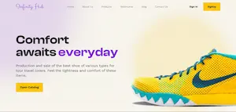

<h1 align="center">Hi 👋, I'm Erik Medina</h1>
<h3 align="center">Passionate about programming and design</h3>

    

- 📖 I’m currently learning **Python in Talento Tech**

- 💬 Ask me about **Javascript**

<h2>Projects</h2>

